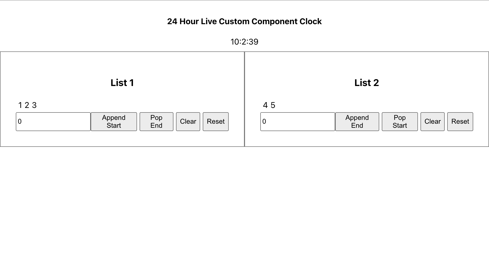

# Task

- Create a Similar page using the Provided Boilerplate
  

# Getting Started

1. Fork this repository [https://github.com/riteshf/rct-201-e1-boilerplate](https://github.com/riteshf/rct-201-e1-boilerplate)
2. Clone the forked app from your github account..
3. navigate to the folder `cd rct-201-e1-boilerplate`
4. npm install
5. npm start

## Understanding Component Structure

- [App](./src/App.js)

  - [Clock](./src/components/Clock.tsx)
  - [List1](./src/components/List1.tsx)
  - [List2](./src/components/List2.tsx)
  - [useClock](./src/hooks/useClock.tsx)

    ```js
         return {
           hours: /** Current time in hours */,
           minutes: /** Current time in minutes */,
           seconds: /** Current time in seconds */,
          };
    ```

  - [useNumberList](./src/hooks/useNumberList.tsx)
    ```js
      return {
         list: /** List of numbers */,
         appendStart: /** Function to append element at start */,
         appendEnd: /** Function to append element at end of list */,
         popStart: /** Function to pop element at start of list */,
         popEnd: /** Function to pop element at the end of list */,
         clear: /** Function to clear the list and set it to empty */,
         reset: /** Function to reset list values to the original values */
       };
    ```

**Note** - `Make sure you use only the given components and dont create new files and folders as chaging component name, structures might result in giving you zero marks`

## Mandatory:

1. Use of Typescript is mandatory, and mentioning types is also mandatory.
2. Use go given custom hooks in mandatory.

## Features to build

1. A Live Clock showing Current Time in 24Hrs format as showm in image.

   - Should use `useClock` hook.

2. `List1`:
   - Should have `initalValues` and `label` as props.
   - Show use `useNumberList` hook to get following functionality:
     - list: elements that are present in the list.
     - appendStart: to append element at start of the list.
     - popEnd: to pop elements at the end of the list.
     - clear: to set the list to empty.
     - reset: to reset the value of list to `initalValues`.
3. `List2`:
   - Should have `initalValues` and `label` as props.
   - Show use `useNumberList` hook to get following functionality:
     - list: elements that are present in the list.
     - appendEnd: to append element at end of the list.
     - popStart: to pop elements at the start of the list.
     - clear: to set the list to empty.
     - reset: to reset the value of list to `initalValues`.

**Note** - `Make sure you implelement features one by one and deploy the app correctly`

## General Instructions (**_IMPORTANT_**)

1. Typescript is mandatory.
2. Use of Custom Hooks is mandatory
3. Do not use Global CSS, instead use `<componentName>.module.css` convention for Css in that file.
4. Do Not Remove `data-testid="xxxx"` from anywhere, this are used by testing tools to test your code, removal of this will lead to low score.
5. Make sure you use only the given components and dont create new files and folders as chaging component name, structures might result in giving you zero marks
6. Make sure you use only the given data and dont create new data, as chaging data might result in giving you zero marks


## Just for fun, things you can try (**_OPTIONAL_**)
- Try running `npm run test`
  - might help you to avoid obvious mistakes.